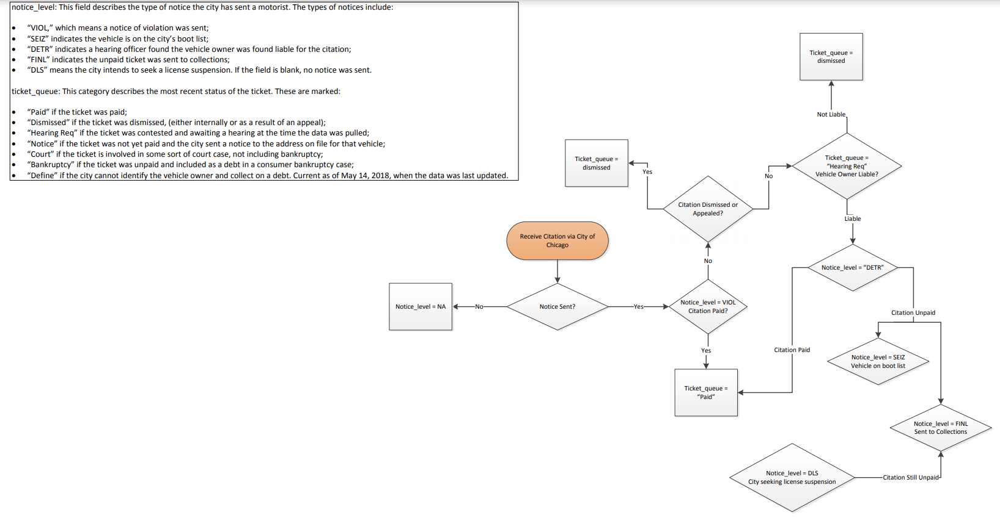
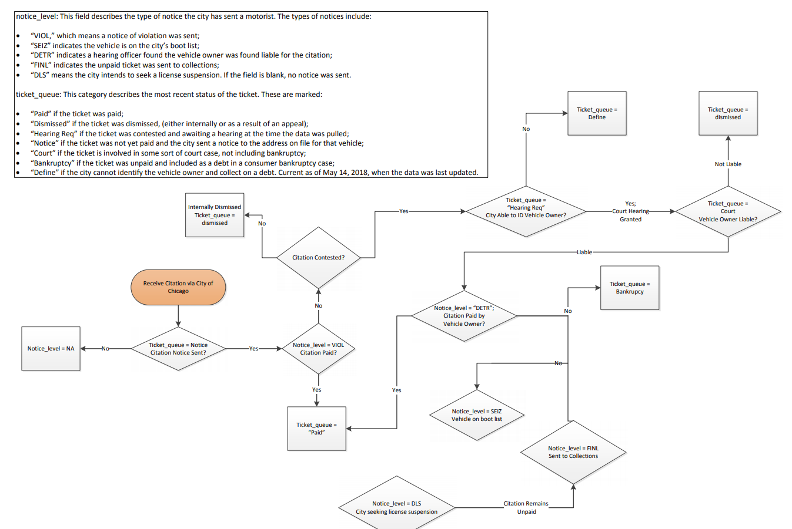

```{r message=FALSE, warning=FALSE}
library(tidyverse)
library(lubridate)
knitr::opts_chunk$set(fig.width=6, fig.height=3)
```

<!-- .Rmd files use  markdown, a text mark up language, to provide formating.--> 
<!--Text include within these strange arrows are comments and will not show up when you knit-->

This submission is my work alone and complies with the 30535 integrity policy.

Add your initials to indicate your agreement: **ES_GATW**

Add your collaborators: **ES_GATW**

Late coins used this pset: 2. Late coins left: 7 (ES), 6 (GATW). 
<!--You may use up to two for a given assignment.)-->

# Part I
Read this (https://features.propublica.org/driven-into-debt/chicago-ticket-debt-bankruptcy/) article and this (https://www.propublica.org/article/chicago-vehicle-sticker-law-ticket-price-hike-black-drivers-debt) shorter article. Melissa Sanchez will be our second guest speaker (Monday May 10 at 3:30 pm). If you are curious to learn more, this (https://www.propublica.org/series/driven-into-debt) page has all of the articles that ProPublica has done on this topic.

## Read in one percent sample (10 points) 
<!--(Notice the use of two `##`)-->
1. To help you get started, the repository contains the file parking_tickets_one_percent.csv which gives you a one percent sample of tickets. We constructed the sample by selecting ticket numbers that end in 01. How long does it take to read in this file? (Don't time your code with your watch, find a function to measure how long it takes the command to run.) Use test_that to check that there are 287458 rows.
```{r}
start <- Sys.time()
parking_tix_1 <- read.csv("parking_tickets_one_percent.csv")
end <- Sys.time()

read_time <- end - start
read_time
```
```{r, message=FALSE}
library(testthat)
test_that('data dimensions correct', {
    expect_equal(ncol(parking_tix_1), 24)
    expect_equal(nrow(parking_tix_1), 287458)
})
```
2. How many megabytes is the file? Using math, how large would you predict the full data set is?

We know the file gives us a one percent sample of the full dataset of tickets. By running code to calculate 138.5 Mb, we multiply it by 100 to predict the full data set size and get 13850 Mb as an estimated size.
```{r}
print(object.size(parking_tix_1), units="Mb")
```
3. How are the rows ordered?

The rows are ordered in terms of ticket issue date from oldest to newest. The dates range from January 2007 to May 2018.

4. For each column, how many rows are NA? Write a parsimonious command which calculates this. You will not get credit for a command which writes out every variable name.
```{r}
parking_tix_1 %>%
  select(everything()) %>%
  summarise_all(list(~sum(is.na(.))))
```

5. Three variables are missing much more frequently than the others. Why? (Hint: look at some rows and read the data dictionary written by ProPublica, inside the repository data_dictionary.txt)

The three variables that have the most missing values are 1) hearing_disposition, 2) notice_level, and 3) zipcode. This may be the outcome because there are many tickets not contested, and not registered. 

## Cleaning the data and benchmarking (10 points)
1. How many tickets were issued in tickets_1pct in 2017? How many tickets does that imply were issued in the full data in 2017? How many tickets are issued each year according to the ProPublica article? Do you think that there is a meaningful difference?

In 2017, 22,364 tickets were issued according to this one percent sample. This implies over a one-hundred percent sample, roughly 2,236,400 total tickets were issued that year. According to the ProPublica article, over 3 million tickets are issued by the City of Chicago each year. The ~764,000 difference could be pointed at this sample only representing parking tickets, while the 3 million total represents a wide range of parking, vehicle compliance and automated traffic camera violations.
```{r}
parking_tix_1 %>%
  filter(issue_date >= as.Date("2017-01-01") & issue_date <= as.Date("2017-12-31")) %>%
  summarise(n = length(X))
```
2. What are the top 20 most frequent violation types? Make a bar graph to show the frequency of these ticket types. Make sure to format the graph such that the violation descriptions are legible and no words are cut off.
```{r}
tail(names(sort(table(parking_tix_1$violation_description))), 20)
```
```{r}
top20_violations <- parking_tix_1 %>%
  group_by(violation_description) %>%
  count(violation_description) %>%
  arrange(desc(n)) %>%
  head(20)

ggplot(top20_violations) +
  geom_col(aes(x = fct_reorder(violation_description, n), y = n)) + 
  coord_flip()

```

## Joins - unit (10 points)
The data tell us what unit of city government issued the ticket, but we need to merge on a crosswalk. 

1. For how many tickets is unit missing?
```{r message=FALSE, warning=FALSE, eval=TRUE}
# NOTE: If we filter to find the string "NA", we get zero:

# missing_units <- parking_tix_1 %>%
#  filter(unit == "NA") %>%
#  count(n())

parking_tix_1 %>%
  select(unit) %>%
  summarise(sum(is.na((.))))
```

2. Read in unit_key.csv. How many units are there?
```{r}
unit_key <- read.csv("unit_key.csv", skip = 2)

unit_key %>%
  summarise(total_units = n_distinct(Reporting.District))
```

3. Join unit key to the tickets data. How many rows in the tickets data have a match in the unit table? How many rows are unmatched? How many rows in the unit table have a match in the tickets data? How many do not?
```{r}
# use left join
unit_key1 <- unit_key %>% 
  rename(unit = Reporting.District) %>%
  select(-X, -Department.Category.1) %>%
  mutate(unit = as.numeric(unit))

parking_tix_2 <- parking_tix_1 %>%
  left_join(unit_key1, by = "unit")
```

```{r, eval=FALSE}
library(dplyr)
# identifying rows that exist in the tickets data, but not in the unit table 
anti_join(parking_tix_2, unit_key1, by = "unit")

# identifying rows that exist in the unit table but not in the tickets data
anti_join(unit_key1, parking_tix_2, by = "unit")
```


4. Who issues more tickets - Department of Finance or Chicago Police? Within Chicago Police, what are the top 5 departments that are issuing the most tickets? Be careful what your group by here and avoid columns with ambiguities.

We run code below that shows us that Department of Finance is responsible for the most tickets in our one percent sample, with 143909. CPD is close in second with 127,223 tickets. DOF and CPD combine to issue ~94% of all tickets in our dataset. Chicago Parking Meter, Miscellaneous departments, and Streets and Sanitation are the third, fourth, and fifth most in terms of issuing tickets. SERCO is a notable mention issuing 37,426 tickets which would be third most on our department list. The company, however, is under DOF.
```{r}
parking_tix_2 %>%
  group_by(Department.Name) %>%
  summarise(n = n()) %>%
  arrange(desc(n))
  
```

```{r}
parking_tix_2 %>%
  group_by(Department.Category) %>%
  summarise(n = n()) %>%
  arrange(desc(n))
  
```

## Joins - ZIP code (15 points)
1. Download recent census data by ZIP for Chicago with population, share black and median household income. chi_zips.csv
```{r, warning=FALSE}
# Census slides
library(tidycensus)

# DELETE BEFORE SUBMIT

census_data <- get_acs(
  geography = "zip code tabulation area",
  variables = c(population = "B01003_001",
                black = "B02001_003",
                medincome = "B19013_001"),
          year = 2018
  ) %>%
  arrange(NAME)

census_data <- census_data %>% 
  separate(NAME, into = c("ZCTA5", "zipcode"), 
  sep = " ") %>% 
  mutate(zipcode = as.numeric(zipcode)) %>%
  pivot_wider(names_from = variable, values_from = c(estimate, moe))
```

2. Clean vehicle registration ZIP and then join the Census data to the tickets data

```{r, warning=FALSE}
chi_zips <- read.csv("chi_zips.csv")

parking_tix_2 <- parking_tix_2 %>%
  mutate(zipcode = strtrim(parking_tix_2$zipcode, 5))

tickets1pct <- parking_tix_2 %>%
  mutate(zipcode = as.numeric(zipcode)) %>%
  left_join(census_data, by = "zipcode")

```
3. Replicate the key findings in the ProPublica by ranking ZIPs by the number of unpaid tickets per resident by ZIP. What are the names of the three neighborhoods with the most unpaid tickets?

The three zip codes with the most unpaid tickets per resident are 60623, 60620, and 60651. Using a google search for the appropriate link, these neighborhoods are named South Lawndale, Auburn Gresham, and Humboldt Park respectively. (link: https://www.unitedstateszipcodes.org/60623/)

```{r}
tickets1pct_unpaid <- tickets1pct %>%
  filter(ticket_queue != "Paid",  ticket_queue != "Dismissed") %>%
  group_by(zipcode, ticket_queue, GEOID) %>%
  summarise(n = n()) %>%
  arrange(desc(n)) %>% 
  head(4)

tickets1pct_unpaid <- tickets1pct_unpaid %>% filter((!is.na(zipcode)))

```

4. (extra credit) Make #3 into a map

```{r, message=FALSE}
map <- get_acs(state = "IL", geography = "zcta",
                  variables = "B19013_001", geometry = TRUE) %>% 
       separate(NAME, into = c("ZCTA5", "zipcode"), 
       sep = " ") %>% 
       mutate(zipcode = as.numeric(zipcode))

map <- left_join(map, tickets1pct_unpaid, by = "zipcode")

map2 <- map %>% 
  filter(zipcode%in%chi_zips$ï..ZIP)

map2  %>% 
  ggplot(aes(fill = n)) +
  geom_sf() + 
  labs(title = "Three Zipcodes with Most Unpaid Ticket",
       caption = "Source: ProPublica 2018")

```

# Part II
## Understanding the structure of the data (20 points)
1. Most violation types double in price if unpaid. Does this hold for all violations? If not, find all violations with at least 100 citations that do not double. How much does each ticket increase if unpaid?

No, not all violations double in price if unpaid. We found four violations with at least 100 citations that do not double: Park or Block Alley, Disabled Parking Zone, Smoked/Tinted Windows Parked/Standing, and Block Access/Alley/Driveway/Firelane. 

```{r}
non_double_violations <- parking_tix_2 %>%
  filter(fine_level2_amount < 2*fine_level1_amount) %>%
  group_by(violation_description) %>%
  summarise(n = n()) %>%
  arrange(desc(n)) %>%
  filter(n > 100)
  
```

Next, lets examine how much do tickets in our sample increase if left unpaid. By simply looking at the fine level 1 and 2 amounts compared to the current amount due, there seems to be a lot of variation. We quantified these observations by calculating fine ratio and percent increases. We confirmed most violation types double in price if unpaid. We also noted that level 2 fines varied in how they increased: either being a quarter, half, two-thirds, or double the price of level 1. Finally, there are also instances where people owe current balances that are more than 200-300% of the original fine!

```{r}
tickets1pct_unpaid2 <- tickets1pct %>%
  filter(ticket_queue != "Paid",  ticket_queue != "Dismissed") %>%
  select(ticket_queue, fine_level1_amount, fine_level2_amount, current_amount_due) %>% mutate(
    fine_ratio_increase=round(fine_level2_amount/fine_level1_amount,2),
    fine_percent_increase=round((current_amount_due-fine_level1_amount)/(fine_level1_amount)*100,0))

tickets1pct_unpaid2 %>% 
  group_by(ticket_queue, fine_ratio_increase) %>%
  summarise(n = n()) %>%
  arrange(desc(n))

tickets1pct_unpaid2 %>% 
  group_by(ticket_queue, fine_ratio_increase) %>%
  distinct(fine_percent_increase) %>%
  arrange(desc(fine_percent_increase))
```

2. Many datasets implicitly contain information about how a case can progress. Draw a diagram explaining the process of moving between the different values of notice_level (if you draw it on paper, take a picture and include the image using knitr::include_graphics). Draw a second diagram explaining the different values of ticket_queue. If someone contests their ticket and is found not liable, what happens to notice_level and to ticket_queue? Include this in your drawings.


```{r, echo=FALSE, out.width="70%", fig.align = 'center', fig.cap="Diagram 1"}

```

```{r, echo=FALSE, out.width="70%", fig.align = 'center', fig.cap="Diagram 2"}

```


\newpage
3. Are any violation descriptions associated with multiple violation codes? If so, which descriptions have multiple associated codes and how many tickets are there in each description-code pair? (Hint: this can be done in just four lines of code)

```{r}
tickets1pct %>%
  group_by(violation_description, violation_code) %>%
  summarise(n = n()) %>%
  arrange(violation_description)
  
```

4. Are there any violation codes associated with multiple violation descriptions? If so, which codes have multiple associated descriptions and how many tickets are there in each description-code pair?

```{r}
tickets1pct %>%
  group_by(violation_code, violation_description) %>%
  summarise(n = n()) %>%
  arrange(desc(violation_code))
  
```

5. Review the 50 most common violation descriptions. Do any of them seem to be redundant? If so, can you find a case where what looks like a redundancy actually reflects the creation of a new violation code?
```{r}
# Finding the 50 most common:
(descrip_50 <- tickets1pct %>%
  group_by(violation_description, violation_code) %>%
  summarise(n = n()) %>%
  arrange(desc(n)) %>% 
  head(50))

# Finding redundancy:
descrip_50 %>% 
  filter(str_detect(violation_description, "NO CITY STICKER"))

```

## Revenue increase from "missing city sticker" tickets (35 points)
Some of the other articles on the Propublica website discuss an increase in the dollar amount of the ticket for not having a city sticker.

1. What was the old violation code and what is the new violation code? How much was the cost of an initial offense under each code? (You can ignore the ticket for a missing city sticker on vehicles over 16,000 pounds.)

The old violation code was 0964125 and the new one is 0964125B. The initial offense under the old one was 120 and it is 200 foe the new one.

```{r}
missing_city <- tickets1pct %>% 
  filter(str_detect(violation_description, "NO CITY STICKER"))
  
missing_city %>% group_by(violation_code, violation_description) %>% summarise(n=n())

missing_city  <-  missing_city %>% filter(violation_code != "0964125C")

missign <- missing_city %>% 
  select(violation_code, issue_date, fine_level1_amount, everything()) %>% 
  arrange(issue_date)

missign %>% head(1)
missign %>% tail(1)

```

2. Combining the two codes, how have the number of missing sticker tickets evolved over time?

```{r}
missign_ev <- tickets1pct %>% 
  filter(violation_code == "0964125" | violation_code == "0964125B")

missign_ev %>% ggplot(aes(x = as_date(issue_date))) + 
  geom_freqpoly(aes(color = violation_code))

```

3. Using the dates on when tickets were issued, when did the price increase occur?

It was with the first type of "0964125B" violation code, which occurred in 2012-02-25 (at 02:00:00).

```{r}
missign_ev %>% ggplot(aes(x = as_date(issue_date), y = fine_level1_amount)) + 
  geom_line(aes(color = violation_code))

missign_ev %>% filter(violation_code == "0964125B") %>% 
  arrange(issue_date) %>% 
  head(1)

```
\newpage
4. The City Clerk said the price increase would raise by $16 million per year. Using only the data available in the calendar year prior to the increase, how much of a revenue increase should she have projected? Assume that the number of tickets of this type issued afterward would be constant and you can assume that there are no late fees or collection fees, so a ticket is either paid at is face value or is never paid.

We already know that the increase in the fine is from 120 to 200, only considering level 1 fine. Then, to estimate the increase in the raise in revenues, we will employ only level 1 fines increase, and will use the amount of the following variables in 2011, which is the year previous to the increase in the fine amount: number of fines, total fine amount and ratio of payment:

```{r}
tickets_before <-  tickets1pct %>% 
  mutate(year = str_sub(issue_date, 1, 4)) %>% 
  filter(violation_code == "0964125" | 
           violation_code == "0964125B" 
         | violation_code == "0976170")

tickets_before <- tickets_before %>% filter(year == "2011")

tickets_before %>% summarise(n=n(),
            amount = sum(total_payments + current_amount_due),
            paid = sum(total_payments),
            ratio_pay = (sum(total_payments)/(sum(total_payments + current_amount_due))))
  
```

Then, as counterfactual we get that, under the old fine amount, the total number of this type of fines was 1935, the annual amount in fines was 372,409.5 and the ratio of payment was 0.5703213. After adjusted by the ratio of payment, the collected amount in the year was 212,393.1 dollars. Finally, after adjusting it in terms of percentages, it turns 21,239,300.1 dollars.

Second, considering the same amount of annual fines (1935), at the cost of 200 dollars, we can estimate an annual amount in this type of fine of 387,000 dollars, which after adjusting in terms of ratio of payment turns 220,714.3. Finally, after adjusting it in terms of percentages, it turns 22,071,434 dollars.

Finally, calculating the raise implies contrasting the annual amount collected under the old fine amount with that projected under the new fine amount: 22,071,434 - 21,239,300.1, which is 832,133.9 dollars. Therefore, the projected increase in the revenues is by fay smaller than that indicated by the city clerk.


5. What happened to repayment rates on this type of ticket in the calendar year after the increase went into effect? If the City had not started issuing more of these tickets, what would its change in revenue have been?

As we have seen before, the payment rate in the year prior to the increase in the fine amount was 0.5703213.

To identify what the revenues would be had the city have not increased the number of fines, we need to see, first, what were the number of this type of tickets, the amount collected, and contrast it to the counterfactual scenario considering the same rate of payment.

```{r}
tickets_before <-  tickets1pct %>% 
  mutate(year = str_sub(issue_date, 1, 4)) %>% 
  filter(violation_code == "0964125" | 
           violation_code == "0964125B" 
         | violation_code == "0976170")

tickets_before <- tickets_before %>% filter(year == "2012")

tickets_before %>% summarise(n=n(),
            amount = sum(total_payments + current_amount_due),
            paid = sum(total_payments),
            ratio_pay = (sum(total_payments)/(sum(total_payments + current_amount_due))))
```
Considering the amount of tickets in 2011 and the same ratio of payment, it would had been: 1935 (number of tickets 2011) * 200 (new fine amount) * 0.5703213 (2011 ratio of payment), which is: 220,714.3. Finally, after adjusting it in terms of percentages, it turns 22,071,400.3 dollars. Then, in contrast to the amount collected in 2011, which was 21,239,300.1 dollars, they nuder this scenario, they would have collected 832,100.2 dollars more in revenues.

6. Make a plot with the repayment rates on not city sticker tickets and a vertical line at when the new policy was  introduced. Interpret.

```{r}
missign_repay <- tickets1pct %>% 
  filter(violation_code == "0964125" | violation_code == "0964125B" | violation_code == "0976170")

missign_repay <- missign_repay %>% mutate(year = str_sub(issue_date, 1, 4))

missign_repay <- missign_repay %>% 
  group_by(year) %>% 
  summarise(pay = sum(total_payments),
            due = sum(current_amount_due),
            ratio = pay/(pay+due))

missign_repay %>% 
  ggplot(aes(x = as.numeric(year), y = ratio)) +
  geom_line(color = "blue") +
  labs(x="Year", y="Ratio of payment") +
  ggtitle("Evolution of Ratio of payment Missing City Sticker Fine") + 
  theme(plot.title = element_text(hjust = 0.5)) +
geom_vline(aes(xintercept = 2012), color="red")
```

After the increase in the amount of the fine of missing city sticker, the rate of payment in this type of fine was already falling. Once the new policy started, the rate of payment decline increased until reaching a very low level in 2018.

7. Still focusing on the period before the policy change, suppose that the City Clerk were committed to getting revenue from tickets rather than other sources. What ticket types would you as an analyst have recommended she increase and why? Name up to three ticket types. Assume there is no behavioral response (i.e. people continue to commit violations at the same rate and repay at the same rate), but consider both ticket numbers and repayment rates.

```{r}
fine_option <-  tickets1pct %>% mutate(year = str_sub(issue_date, 1, 4))

fine_option <- fine_option %>% filter(year == "2012")

fine_option %>% 
  group_by(violation_description) %>% 
  summarise(pay = sum(total_payments),
            due = sum(current_amount_due),
            ratio = pay/(pay+due)) %>% 
  filter(ratio == "1") %>% 
  arrange(desc(pay)) %>% 
  head(3)
```

8. In the previous question, the City Clerk was only optimizing gross revenue. Melissa Sanchez argue that ticketing is inherently regressive. Let's say the City Clerk took this critique to heart and determined to raise ticket prices for violations that would affect households in high income zip codes more than low income zip codes.

  a. What ticket types would you as an analyst recommend she increase and why? Make a data visualization to support your argument.
  
```{r}
census_2 <- census_data %>%
    mutate(quantile = as.character(ntile(estimate_medincome, 10)))

census_2 <- census_2 %>% mutate(quantile_2 = str_c("quantile ", quantile))

high_fine <- parking_tix_2 %>%
  mutate(zipcode = as.numeric(zipcode)) %>%
  left_join(census_2, by = "zipcode")

high_fine <-  high_fine %>% mutate(year = str_sub(issue_date, 1, 4))

high_fine <- high_fine %>% filter(year == "2017")

# choosing the 10 most important fines in terms of revenues
  
revenues_list <-  high_fine %>% 
  group_by(violation_description) %>% 
  summarise(amount = sum(total_payments) + sum(current_amount_due)) %>% 
  arrange(desc(amount)) %>% 
  head(10)

# targeting in terms of high-income zipcodes

high_fine_list <- high_fine %>% 
  filter(violation_description%in%revenues_list$violation_description)

high_fine_list %>% group_by(violation_description) %>% summarise(n=n())

target_fines <-  high_fine_list %>%
  group_by(violation_description,quantile_2) %>%
  summarise(n_fines = n()) %>% 
  pivot_wider(names_from = quantile_2, values_from = n_fines) 
  
target_final <- target_fines %>% select(violation_description, `quantile 10`,`quantile 1`,everything()) %>% 
    arrange(`quantile 1`)

# Then, the three suggested fines will be:

(suggested_fines <- target_fines %>% select(violation_description, `quantile 10`,`quantile 1`,everything()) %>% 
    arrange(`quantile 1`) %>% 
    head(3))

```
  
  
b. If she raises the ticket price by $80 for each of these tickets, how much additional revenue can she expect? Assume there is no behavioral response (i.e. people continue to commit violations at the same rate and repay at the same rate).
  
It is 2393 (number of fines in a year, based on 2017) * 80 (increase) * 0.7243863 (ratio of repayment in 2017), which is 138,676.5. Adjusted by percentages, it is 13,867,600.5 dollars in the year.
  
```{r}
high_fine %>% group_by(violation_description) %>% 
  summarise(n=n(),
            rate_repay = sum(total_payments) / (sum(current_amount_due) + sum(total_payments))) %>% 
  filter(violation_description == "EXP. METER NON-CENTRAL BUSINESS DISTRICT")
```
  
  
  